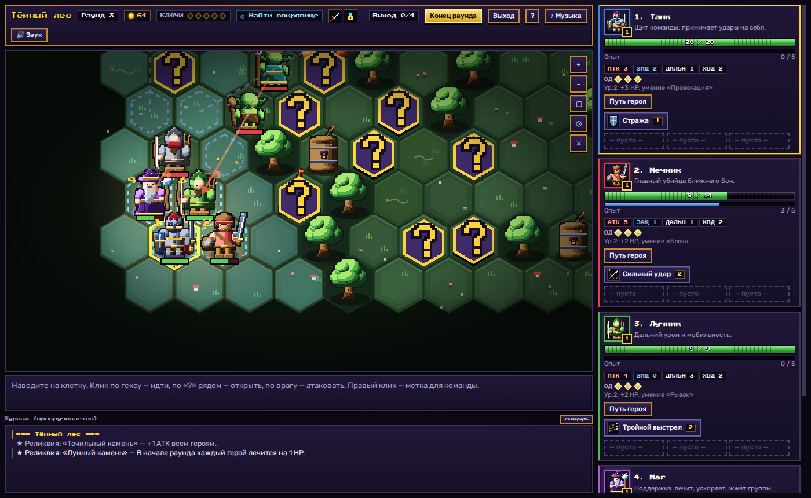
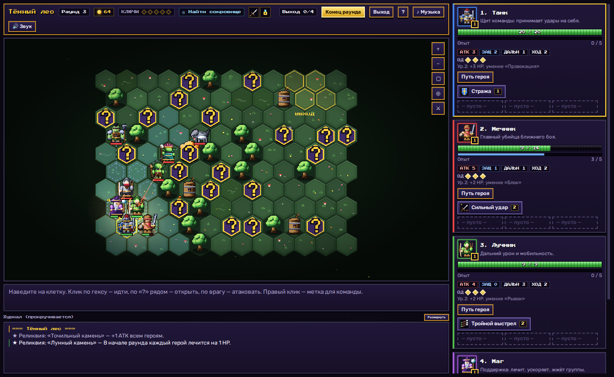
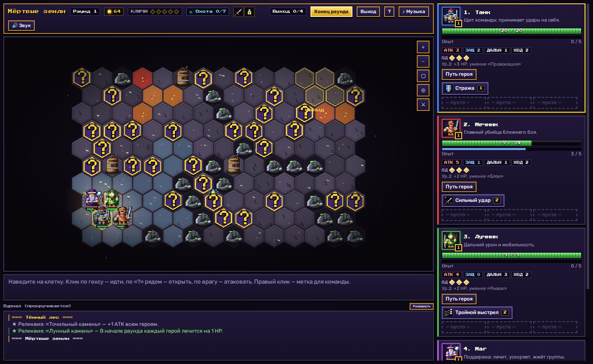
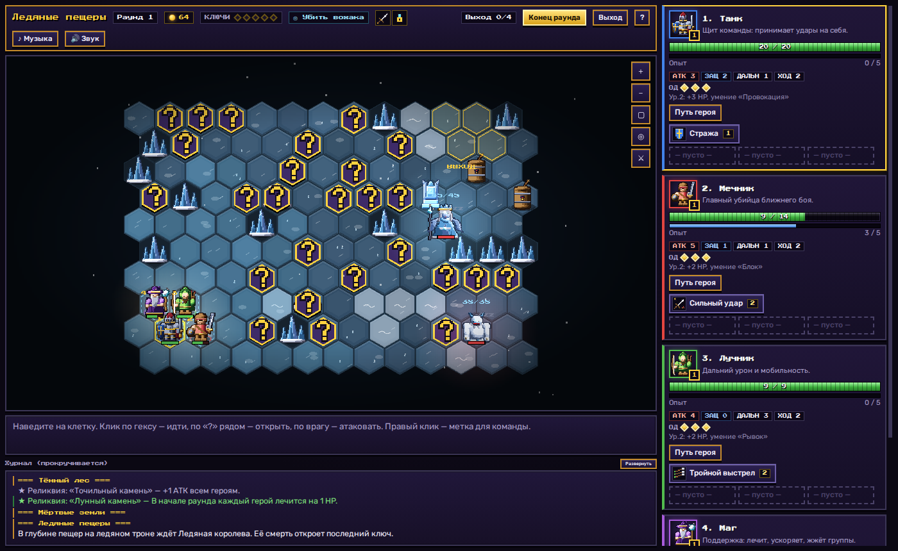
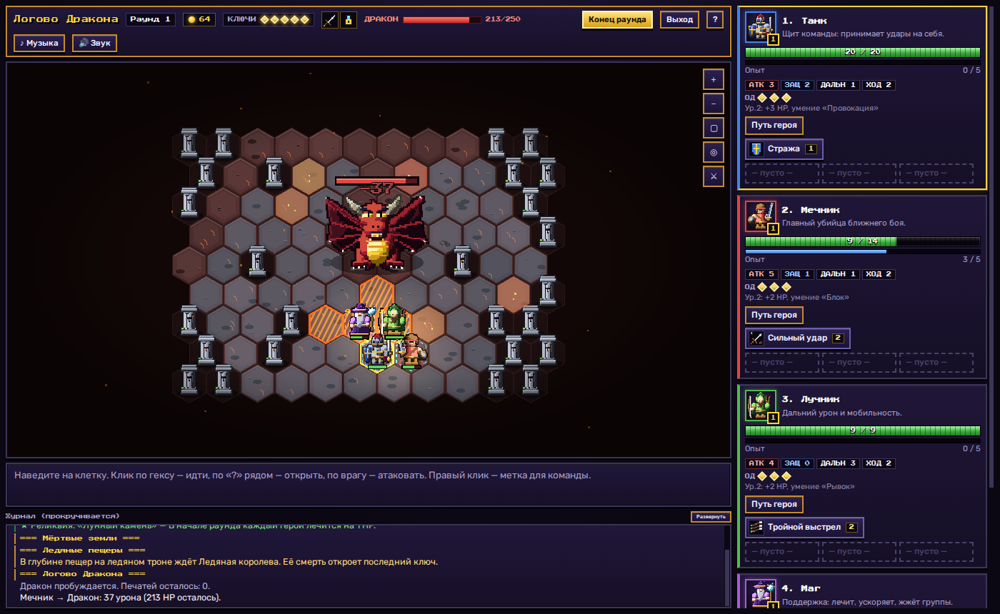
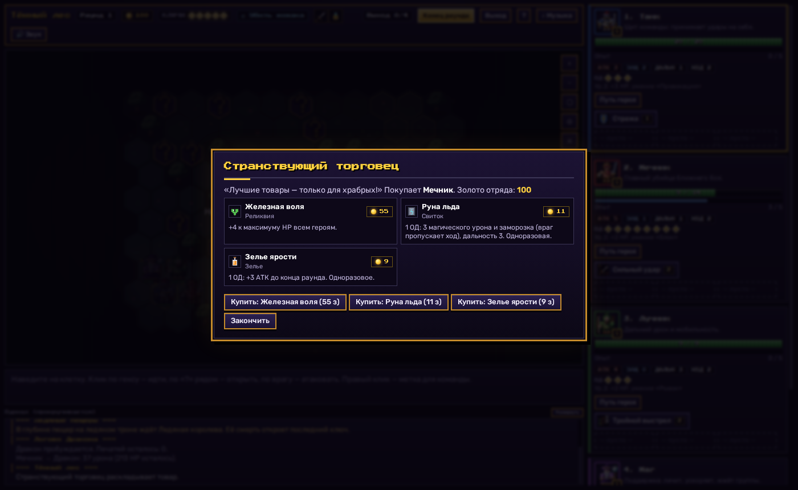
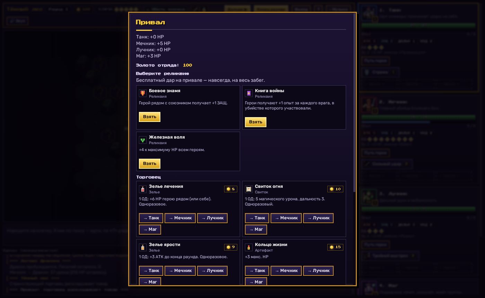
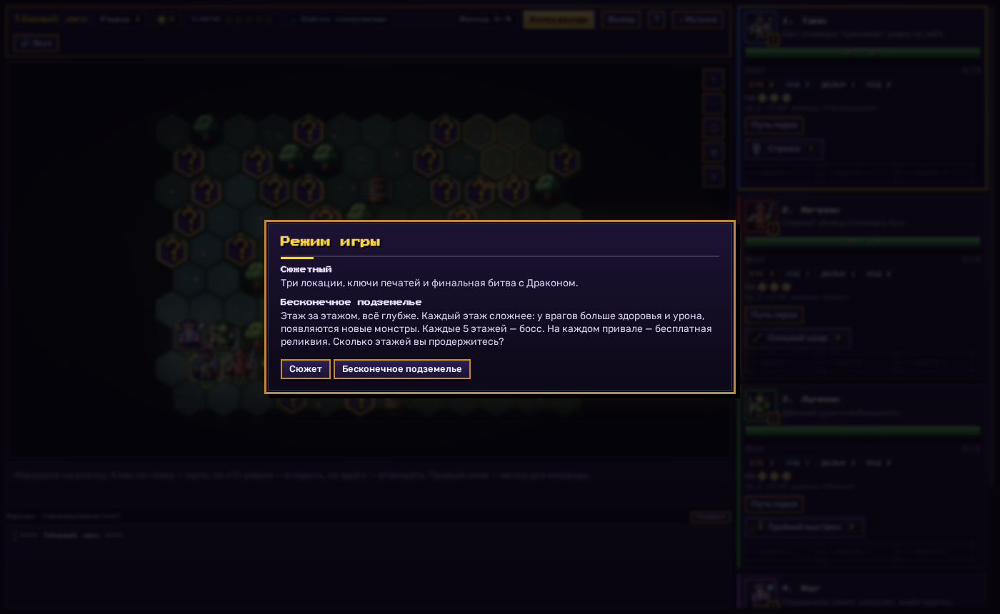
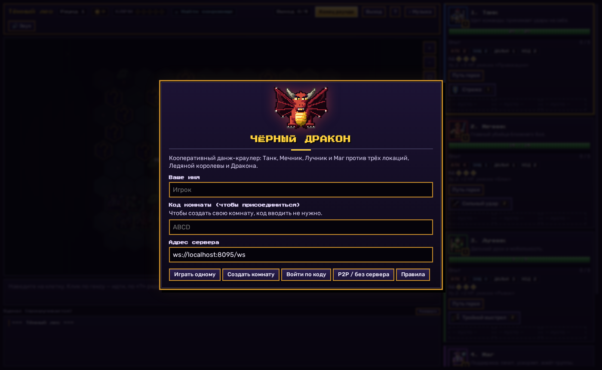
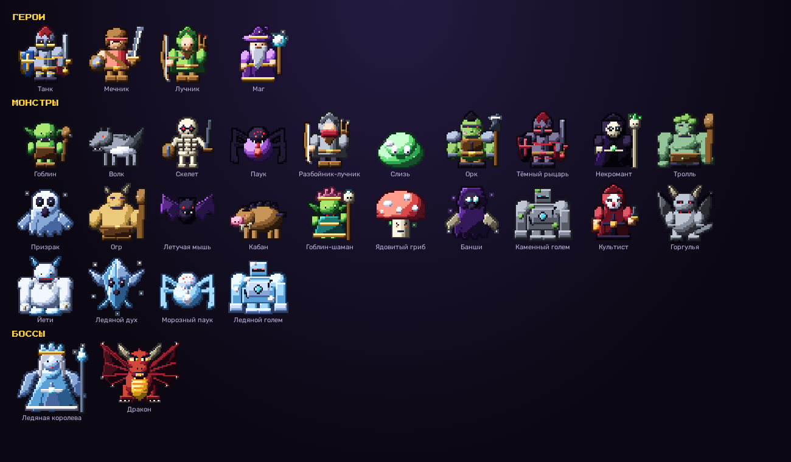

<div align="center">

# 🐉 ЧЁРНЫЙ ДРАКОН

**Кооперативный пошаговый данж-краулер на гексах — прямо в браузере**

Собери отряд из четырёх героев, исследуй подземелья, находи реликвии, разбивай печати — и сразись с Драконом. Или спускайся всё глубже в бесконечном подземелье.

## ▶️ [ИГРАТЬ ОНЛАЙН — black-dragon.online](https://black-dragon.online/)

[](https://black-dragon.online/)




</div>

---

## 📖 Содержание

[О игре](#-о-игре) · [Возможности](#-возможности) · [Скриншоты](#-скриншоты) · [Как играть](#-как-играть) · [Мультиплеер](#-мультиплеер) · [Устройство проекта](#-устройство-проекта) · [Дорожная карта](#-дорожная-карта)

---

## 🎮 О игре

**Чёрный Дракон** — тактическая игра в духе настольных данж-краулеров. Отряд из четырёх героев (на выбор семь классов: Танк, Мечник, Лучник, Маг, Жрец, Разбойник и Паладин) продвигается по полям из шестиугольников, открывают закрытые фишки «?», сражаются с монстрами, находят предметы и золото. Каждая партия отличается: карты, монстры, события и реликвии генерируются случайно.

**Играть прямо сейчас: <https://black-dragon.online/>** — регистрации и установки не нужно.

Играть можно **одному** (остальными героями управляет ИИ), **вдвоём–вчетвером по сети** (и ещё можно **смотреть как зритель**), в **бесконечном подземелье**, в режиме **«Орда»** или в **ежедневном забеге** с одинаковыми картами для всех.

> Вся игра — один HTML-файл. Никаких картинок и звуковых файлов: **спрайты рисуются кодом**, а **музыка и звуки синтезируются** в браузере.

## ✨ Возможности

### ⚔️ Бой и тактика
- Пошаговые бои на гекс-сетке, очки действий, умения и предметы.
- **Фланг:** удар по врагу, когда с противоположной стороны стоит ваш герой, — +2 урона. Комбо с оглушением и поджогом.
- **Отбрасывание:** «Удар щитом» толкает врага в лаву, на бочку с порохом или в другого монстра.
- **Намерения врагов:** стрелки на карте показывают, куда враг пойдёт и кого ударит.
- Статусы (яд, горение, кровотечение, холод), местность (болото, лава, ловушки, взрывные бочки).

### 🧙 Герои и прокачка
- **7 классов** с уникальными умениями, отряд из 4 героев выбирается перед партией. Жрец лечит и карает нежить, Разбойник быстр и бьёт в спину, Паладин лечит соседей и усиливает отряд.
- 5 уровней с **выбором из двух улучшений** на 3-м и 5-м.
- Предметы с ограничениями по классам; предмет для другого героя остаётся лежать на земле.
- **ИИ-союзники:** играйте одним героем, остальные сами лечат, прикрывают и используют умения и предметы.

### 🗺️ Мир
- **Пять локаций:** Тёмный лес, затем на развилке Мёртвые земли или **Гиблые топи**, затем Ледяные пещеры или **Ядовитые катакомбы** + логово Дракона.
- 39 видов монстров, три мини-босса (Ледяная королева, **Гидра топей**, **Королева пауков**) и финальный Дракон, который заранее отмечает гексы огненной атаки.
- **Малые локации:** на карте есть «вход» (пещера, склеп, лаборатория). Подземелье дорисовано справа от основной карты, поэтому видна вся карта сразу. Герой, который встал на вход, оказывается внутри и бьётся с сильными врагами, а остальные в это время продолжают ходить на основной карте — **в том же раунде**. Входить могут несколько героев; выйти можно в любой момент через гекс «НАЗАД». Награда за зачистку — реликвия, золото и редкий предмет.
- **Цели локаций:** убить вожака, охота, найти сокровище, тревога.
- **Случайные события:** странствующий торговец, проклятый алтарь, пленник, три двери, игра в кости, костёр.

### 🏺 Реликвии и экономика
- 16 реликвий — пассивные бонусы на весь забег (от «Точильного камня» до «Проклятой короны»).
- Золото с монстров и сундуков, торговец и костёр на привале.

### ♾️ Другие режимы
- **Бесконечное подземелье:** этаж за этажом, каждый сложнее предыдущего, **босс каждые 5 этажей**, реликвия на каждом привале, таблица лучших экспедиций.
- **Орда:** одна арена и волны врагов; между волнами привал с торговцем, каждые 3 волны реликвия, каждые 5 — босс.
- **Ежедневный забег:** в один день у всех игроков одинаковые карты, привалы и отряд; серия дней подряд и история результатов.

### 🏆 Прогресс между забегами
- 21 достижение и **дары предков** — постоянные бонусы на старт, которые открываются достижениями.
- Всё хранится в браузере игрока.

### 🌐 Мультиплеер
- Комнаты по коду и ссылке, до 4 игроков и до нескольких **зрителей**, **переподключение с сохранением места**.
- Метки на карте и быстрые фразы для команды.
- Сохранение партии в браузере — случайное закрытие вкладки не сбросит прогресс.

### 🎨 Графика и звук
- Рендер на **PixiJS (WebGL)** с автоматическим запасным canvas-режимом.
- Собственный движок «объёмного» пиксель-арта: персонажи собираются из форм с автоматической светотенью; **покадровая анимация** (покой, ходьба, атака, удар).
- Частицы, свет, камера с зумом и перетаскиванием (мышь и сенсорный экран).
- 37 синтезированных звуковых эффектов и **6 музыкальных треков** (чиптюн-секвенсор).
- Адаптивный интерфейс — играть можно и с телефона.
- **Отмена хода** (кнопка или клавиша **Z**) и **настройки доступности**: скорость анимаций, крупный интерфейс, громкость, палитра для дальтоников, меньше эффектов, подтверждение конца раунда.

## 📸 Скриншоты

<table>
  <tr>
    <td><br><sub><b>Тёмный лес</b> — гекс-карта с закрытыми фишками</sub></td>
    <td><br><sub><b>Мёртвые земли</b> — орки, тролли, огры</sub></td>
  </tr>
  <tr>
    <td><br><sub><b>Ледяные пещеры</b> — логово Ледяной королевы</sub></td>
    <td><br><sub><b>Дракон</b> — огненная атака отмечается заранее</sub></td>
  </tr>
  <tr>
    <td><br><sub><b>Случайные события</b> с выбором</sub></td>
    <td><br><sub><b>Привал:</b> реликвия на выбор, торговец, костёр</sub></td>
  </tr>
  <tr>
    <td><br><sub><b>Режимы:</b> сюжет и бесконечное подземелье</sub></td>
    <td><br><sub><b>Меню:</b> одиночная игра, комнаты, коды</sub></td>
  </tr>
</table>

### Бестиарий



## 🕹️ Как играть

| Действие | Как |
|---|---|
| Идти | клик по свободному гексу в подсвеченной зоне (1 ОД = 2 гекса) |
| Открыть фишку «?» | клик по соседней фишке (1 ОД) |
| Атаковать | клик по врагу в зоне дальности (1 ОД) |
| Умение или предмет | кнопка на карточке героя, затем цель на карте |
| Выбрать героя | клик по карточке или клавиши **1–4** |
| Отменить ход | кнопка «↶ Отмена хода» или **Z** (пока ход ничем не отозвался) |
| Настройки | кнопка **⚙** вверху |
| Завершить раунд | кнопка «Конец раунда» или **Пробел** |
| Отмена | **Esc** |
| Метка для команды | правый клик, **Alt+клик**, на телефоне — долгое касание |
| Камера | колесо мыши / щипок для зума, перетаскивание, кнопки **＋ − ▢ ◎** |
| Намерения врагов | кнопка **⚔** возле зума (включить / выключить) |

**Цель сюжетного режима:** найти 5 ключей (два в лесу, два во второй локации, последний хранит мини-босс третьей) и победить Дракона. Чем меньше ключей, тем сильнее босс. На привалах вы сами выбираете путь на развилках.

## 🌐 Мультиплеер

1. Один игрок жмёт **«Создать комнату»** и получает код и ссылку вида `https://адрес/#room=ABCD`.
2. Друзья открывают ссылку (код подставится сам) и жмут **«Войти по коду»**.
3. В лобби каждый берёт героя, хост выбирает отряд, режим и сложность и жмёт **«Начать игру»**.
4. Чтобы просто наблюдать, друзья жмут **«Смотреть игру (зритель)»** вместо «Войти по коду».

**Как это устроено.** Сервер (`server/server.js`, ~80 строк) только пересылает сообщения по WebSocket между хостом и гостями. Вся игровая логика работает в браузере хоста, а гости получают снимки состояния. Поэтому сервер лёгкий — хватит любого мини-ПК.

- Каждый гость получает токен: после обрыва связи он возвращается на своё место с теми же героями.
- Если хост закрыл вкладку, партия сохраняется у него в браузере, а комната поднимается с тем же кодом.
- Запасные способы без сервера (PeerJS и ручной обмен кодами) есть в меню «P2P / без сервера».

## 🧱 Устройство проекта

```
.
├── index.html            # вся игра: правила, ИИ, сеть, интерфейс, рендер
├── server/
│   ├── server.js         # раздача игры + пересылка сообщений комнат (WebSocket)
│   └── package.json
├── vendor/
│   └── pixi.min.js       # PixiJS 7 (MIT), раздаётся самим сервером
├── art/                  # исходники пиксель-арта и анимаций
│   ├── engine.js         # движок объёмного пиксель-арта (материалы, светотень, контур)
│   ├── heroes.js         # герои
│   ├── monsters1..4.js   # монстры по локациям
│   ├── decor.js          # декорации и Дракон
│   ├── anim.js           # покадровая анимация (деформация спрайтов)
│   └── inject.py         # вставляет арт в index.html
├── deploy/               # systemd и nginx
└── docs/screenshots/     # скриншоты для README
```

**Как править графику.** Откройте нужный файл в `art/` (например, `monsters2.js`), измените описание персонажа и выполните:

```bash
python3 art/inject.py
```

Скрипт обновит блок между маркерами `/*ART-BEGIN*/ … /*ART-END*/` в `index.html`.

**Технологии:** JavaScript (без сборщика), PixiJS 7, Web Audio API, WebSocket (`ws`), Node.js. Шрифты: Press Start 2P и Rubik (Google Fonts).

## 🗺️ Дорожная карта

- [x] Новые герои (Жрец, Разбойник, Паладин) и выбор отряда из 7 классов
- [x] Новые локации (Гиблые топи, Ядовитые катакомбы) и мини-боссы
- [x] Развитие между забегами: достижения, открываемые бонусы, ежедневный забег
- [x] Режим «Орда» и наблюдатели
- [x] Отмена хода и настройки доступности
- [x] Малые локации с сильными врагами
- [ ] Балансировка по отзывам игроков
- [ ] Ещё герои и локации, общий рейтинг ежедневных забегов

## 🙏 Благодарности

[PixiJS](https://pixijs.com/) (MIT) · шрифты [Press Start 2P](https://fonts.google.com/specimen/Press+Start+2P) и [Rubik](https://fonts.google.com/specimen/Rubik) (SIL OFL) · [PeerJS](https://peerjs.com/) для запасного P2P-режима. Вся графика, анимации, музыка и звуки созданы кодом в этом репозитории.

---

<div align="center"><sub>Сделано с 🐉 и пикселями</sub></div>
